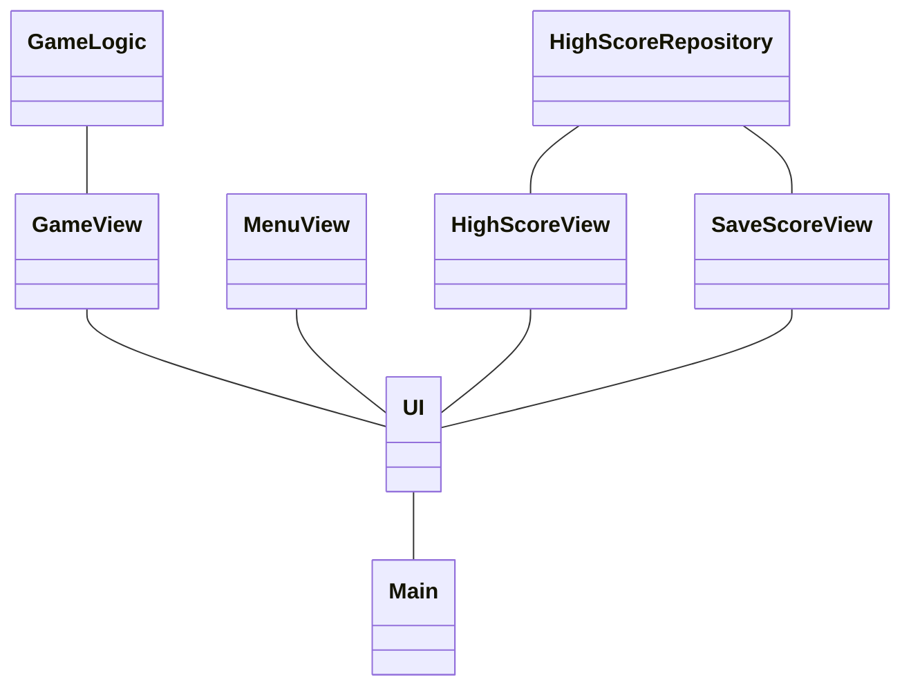
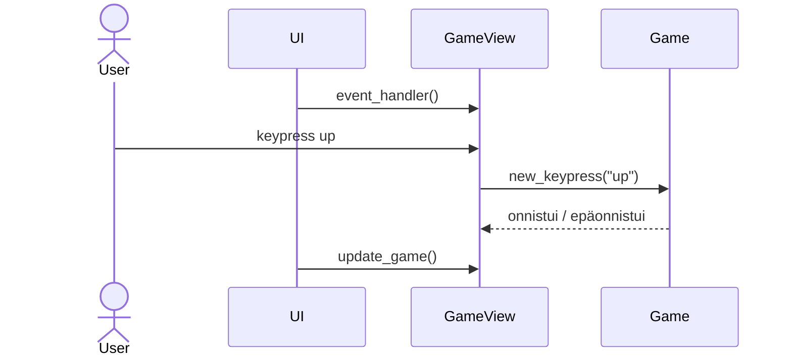

## Pelin rakenne

## Päätoiminnallisuudet
### Pelin pelaaminen
Pelaaminen tapahtuu nuolinäppäimillä, jotka GameView-luokka lukee ja välittää edelleen pelilogiikasta vastaavalle Game-luokalle. Tämän jälkeen piirretään pelin tilanne uudelleen käyttäjälle:
