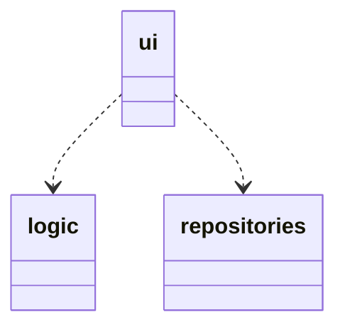
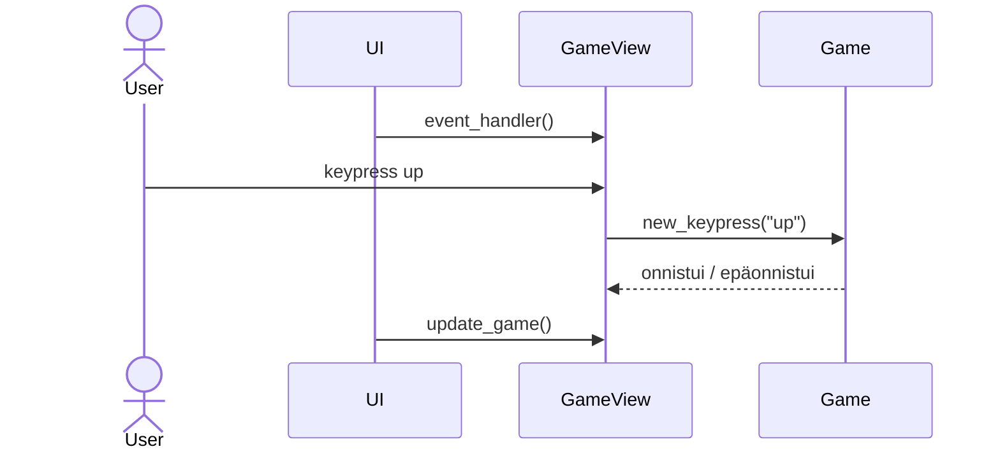
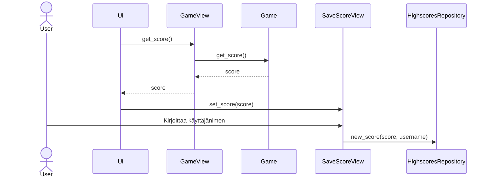

# Arkkitehtuurikuvaus
## Rakenne
Koodin pakkausrakenne on seuraavanlainen:

Pakkaus ui sisältää pelingrafiikan, sekä käyttöliittymän, logic pelilogiikan ja repositories tietokantatoiminnoista vastaavan koodin.

## Käyttöliittymä

Käyttöliittymä sisältää neljä erilaista näkymää:

- Alkuvalikko
- Pelinäkymä
- Tulosten tarkastelu
- Tuloksen tallentaminen

Pelinäkymä pitää myös sisällään pelin loppuessa ilmestyvän valikon. Jokainen näistä näkymistä on omina luokkinaan ja niiden hallinnoimisesta ja näyttämisestä vastaa Ui-luokka.

## Sovelluslogiikka

Pelin toimintalogiikka on mallinnettu 2d-listana, jossa jokainen alkio merkkaa yhtä peliruudukon ruutua. Tämän hallinnasta vastaa Game-luokka. Kun GameView-luokka lukee käyttäjältä näppäimenpainalluksen, välittää se sen Game-luokalle joka tekee muutoksen ruudukkoon näppäinpainalluksen mukaan. Kun GameView-luokka seuraavaksi haluaa piirtää uuden pelitilan, pyytää se 2d-listan Game-luokalta ja piirtää sen perusteella uuden tilan näytölle. 

## Päätoiminnallisuudet
### Pelin pelaaminen
Pelaaminen tapahtuu nuolinäppäimillä, jotka GameView-luokka lukee ja välittää edelleen pelilogiikasta vastaavalle Game-luokalle. Tämän jälkeen piirretään pelin tilanne uudelleen käyttäjälle:

### Tuloksen tallentaminen
Tuloksen tallentaminen tapahtuu päättyneen pelin jälkeen jolloin Game-luokan pistemäärä ja käyttäjän antama nimi viedään HighscoresRepository-luokalle joka hoitaa sen tallentamisen.

