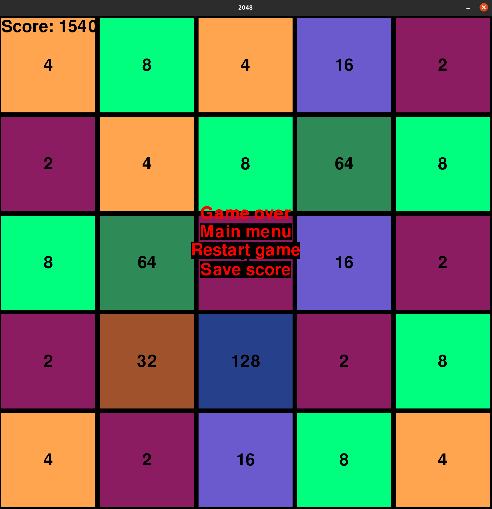

# Käyttöohje
## Aloitusvalikko
Sovellus käynnistyy alkuvalikkoon:\
\
Alkuvalikosta pääsee aloittamaan uuden pelin tai tarkastelemaan parhaimpia tuloksia.
## Pelinäkymä
Pelaaminen tapahtuu pelinäkymässä. Näytölle piirtyy ruudukko ja ruudukon soluihin numeroita. Numeroita voi liikuttaa nuolinäppäimillä ja aina kun kaksi saman suuruista numeroa kohtaavat ne yhdistyvät.\

## Pelin päättyminen
Pelin päätyttyä ruudulle ilmestyy valikko:\
\
Valikosta voidaan aloittaa peli uudelleen tai tallentaa tulos tietokantaan.