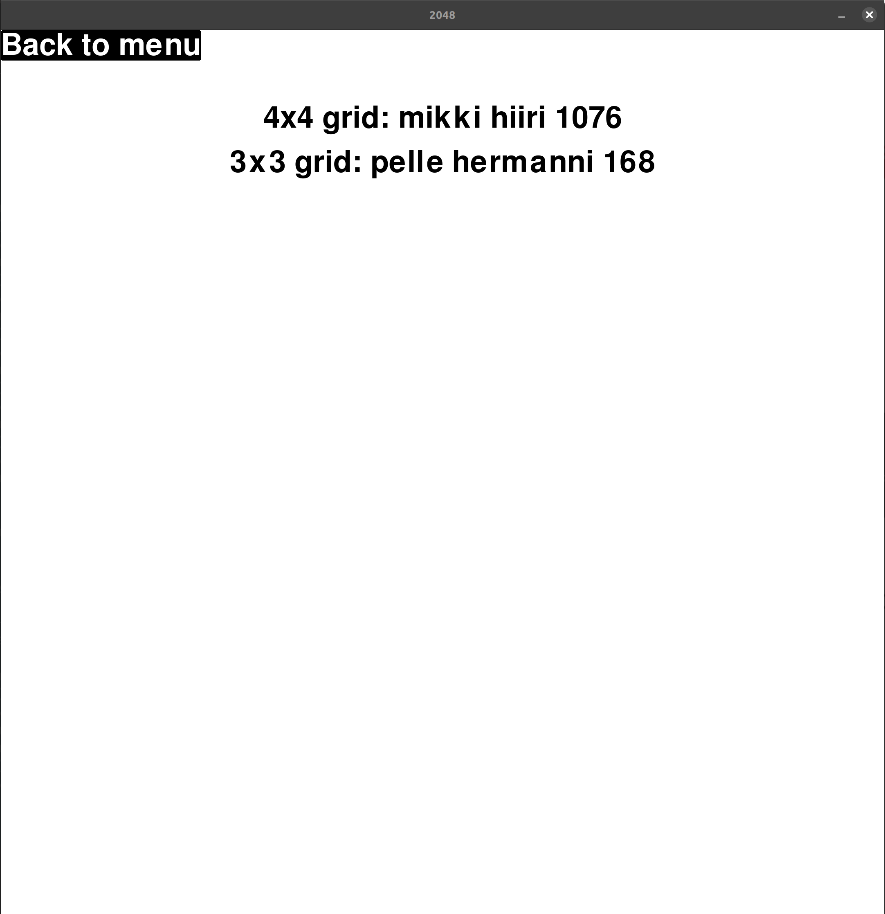

# Käyttöohje
Lataa ohjelman uusin release.
## Asennus
1. Asenna riippuvuudet:
```bash
poetry install
```
2. Alusta tietokanta:
```bash
poetry run invoke initialize
```
3. Käynnistä peli
```bash
poetry run invoke start
```

## Aloitusvalikko
Sovellus käynnistyy alkuvalikkoon:\
\
Alkuvalikosta pääsee aloittamaan uuden pelin tai tarkastelemaan parhaimpia tuloksia.
## Pelinäkymä
Pelaaminen tapahtuu pelinäkymässä. Näytölle piirtyy ruudukko ja ruudukon soluihin numeroita. Numeroita voi liikuttaa nuolinäppäimillä ja aina kun kaksi saman suuruista numeroa kohtaavat ne yhdistyvät. Numeroiden yhdistyminen kasvattaa pistemäärää, joka näkyy vasemmassa yläkulmassa.\


## Pelin päättyminen
Pelin päätyttyä ruudulle ilmestyy valikko:\
\
Valikosta voidaan aloittaa peli uudelleen tai tallentaa tulos tietokantaan.

## Tuloksen tallentaminen
Pelistä saaman tuloksen voi pelin loputtua tallentaa. Tallennusnäkymä lukee käyttäjän näppäinsyötettä ja painamalla save nappia tai enteriä ohjelma tallentaa tuloksen.\


## Tuloksien tarkastelu
Parhaimpia pelistä saatuja tuloksia voi tarkastella päävalikon kautta.\
