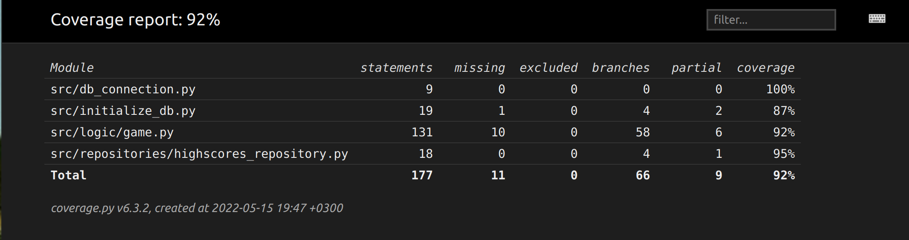

# Testausdokumentti
Ohjelmaa on testattu automaattisin yksikkötestein unittestilla.
## Yksikkötestaus
### Pelilogiikka
Pelilogiikasta vastaa Game-luokka ja sitä testataan GameTest-luokalla. Testeillä testataan erilaisia tilanteita, joissa peli voi olla sekä erilaisia syötteitä mitä se voi saada.
### Repositorio
Tietokantapalveluista vastaa HighscoresRepository-luokka. Sitä on testattu RepositoryTest-luokalla, joka luo valetietokannan jolla voidaan testata operaatioiden toimintaa.
### Testikattavuus
Testikattavuus on 92%. Sen ulkopuolelle on jäänyt kaikki Ui:sta vastaavat luokat.

