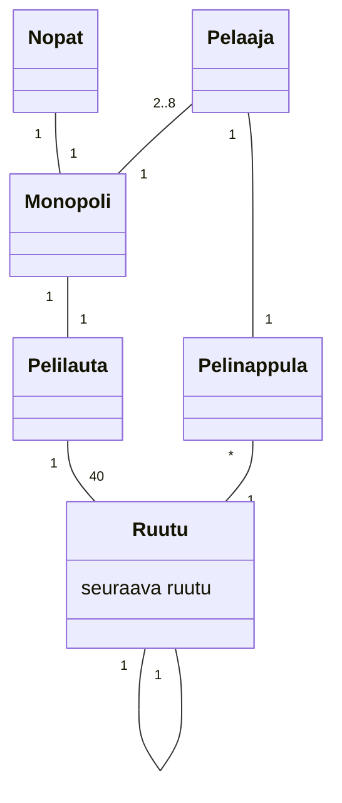

```mermaid
    classDiagram
        Pelilauta "1" -- "40" Ruutu
        Ruutu "1" -- "1" Ruutu
        Nopat "1" -- "1" Monopoli
        Pelaaja "2..8" -- "1" Monopoli
        Pelaaja "1" -- "1" Pelinappula
        Pelinappula "*" -- "1" Ruutu
        Monopoli "1" -- "1" Pelilauta
        class Monopoli{

        }
        class Pelilauta{
    
        }
        class Pelaaja{

        }
        class Nopat{
    
        }
        class Ruutu{
          seuraava ruutu
        }
        class Pelinappula{

        }
```