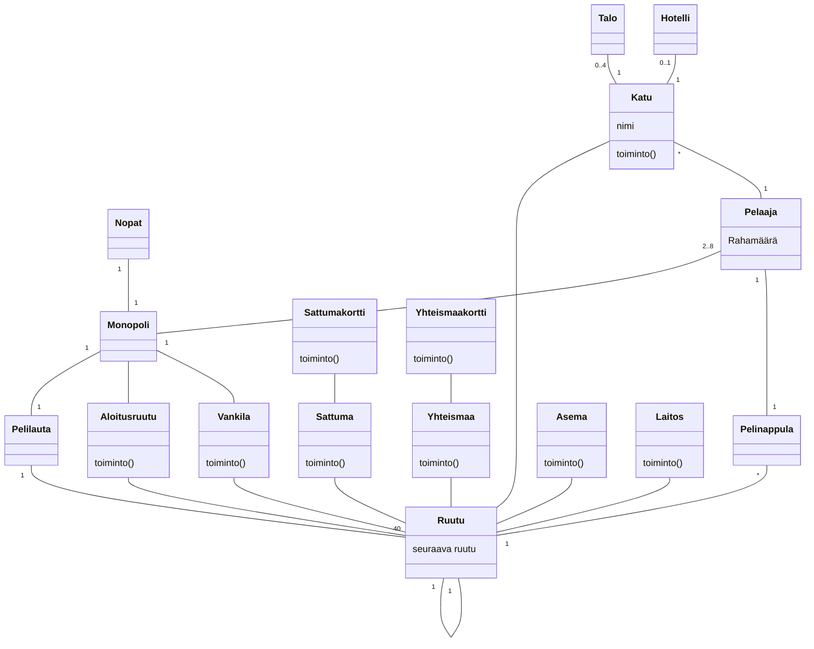

```mermaid
    classDiagram
        Pelilauta "1" -- "40" Ruutu
        Ruutu "1" -- "1" Ruutu
        Nopat "1" -- "1" Monopoli
        Pelaaja "2..8" -- "1" Monopoli
        Pelaaja "1" -- "1" Pelinappula
        Pelinappula "*" -- "1" Ruutu
        Monopoli "1" -- "1" Pelilauta
        class Monopoli{

        }
        class Pelilauta{
    
        }
        class Pelaaja{
            Rahamäärä
        }
        class Nopat{
    
        }
        class Ruutu{
          seuraava ruutu
        }
        class Pelinappula{

        }
        class Aloitusruutu { toiminto() }
        class Vankila { toiminto() }
        class Sattuma { toiminto() }
        class Yhteismaa { toiminto() }
        class Asema{
            toiminto()
        }
        class Laitos{
            toiminto()
        }
        class Katu {
            nimi
            toiminto()    
        }
        class Sattumakortti{ toiminto() }
        class Yhteismaakortti{ toiminto() }
        class Talo
        class Hotelli
        
        Aloitusruutu  --  Ruutu
        Vankila  --  Ruutu
        Sattuma -- Ruutu
        Yhteismaa -- Ruutu
        Asema -- Ruutu
        Laitos -- Ruutu
        Katu -- Ruutu
        Sattumakortti -- Sattuma
        Yhteismaakortti -- Yhteismaa
        Katu "*" -- "1" Pelaaja
        Talo "0..4" -- "1" Katu
        Hotelli "0..1" -- "1" Katu
        Monopoli -- Aloitusruutu
        Monopoli -- Vankila
```