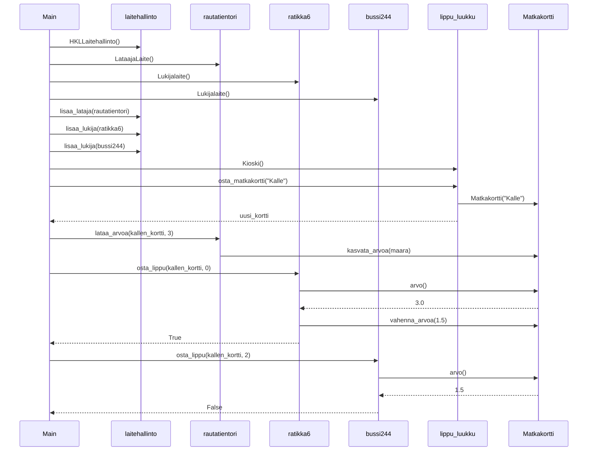

```mermaid
    sequenceDiagram
        Main ->> laitehallinto: HKLLaitehallinto()
        Main ->> rautatientori: LataajaLaite()
        Main ->> ratikka6: Lukijalaite()
        Main ->> bussi244: Lukijalaite()

        Main ->> laitehallinto: lisaa_lataja(rautatientori)
        Main ->> laitehallinto: lisaa_lukija(ratikka6)
        Main ->> laitehallinto: lisaa_lukija(bussi244)

        Main ->> lippu_luukku: Kioski()
        Main ->> lippu_luukku: osta_matkakortti("Kalle")
        lippu_luukku ->> Matkakortti: Matkakortti("Kalle")
        lippu_luukku -->> Main: uusi_kortti
        Main ->> rautatientori: lataa_arvoa(kallen_kortti, 3)
        rautatientori ->> Matkakortti: kasvata_arvoa(maara)

        Main ->> ratikka6: osta_lippu(kallen_kortti, 0)
        ratikka6 ->> Matkakortti: arvo()
        Matkakortti -->> ratikka6: 3.0
        ratikka6 ->> Matkakortti: vahenna_arvoa(1.5)
        ratikka6 -->> Main: True
        Main ->> bussi244: osta_lippu(kallen_kortti, 2)
        bussi244 ->> Matkakortti: arvo()
        Matkakortti -->> bussi244: 1.5
        bussi244 -->> Main: False
```